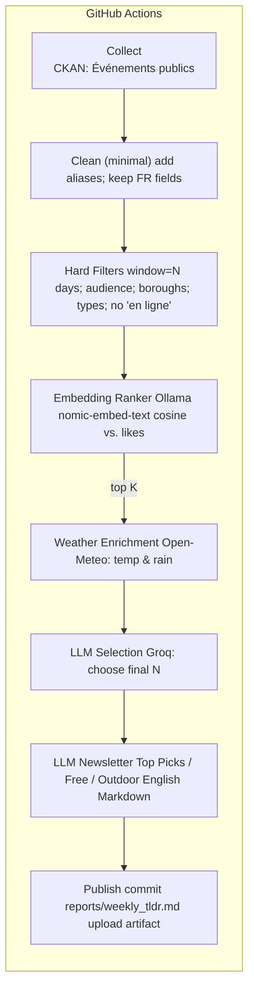

```mermaid
flowchart LR
    A["Collect\n CKAN: Événements publics"] --> B["Clean (minimal) add aliases; keep FR fields"]

    B --> C["Hard Filters window=N days; audience; boroughs; types; no 'en ligne'"]
    C --> D["Embedding Ranker Ollama nomic-embed-text cosine vs. likes"]
    D -->|top K| E["Weather Enrichment Open-Meteo: temp & rain"]
    E --> F["LLM Selection Groq: choose final N"]
    F --> G["LLM Newsletter Top Picks / Free / Outdoor English Markdown"]
    G --> H["Publish commit reports/weekly_tldr.md upload artifact"]

    subgraph "GitHub Actions"
      A
      B
      C
      D
      E
      F
      G
      H
    end
```
